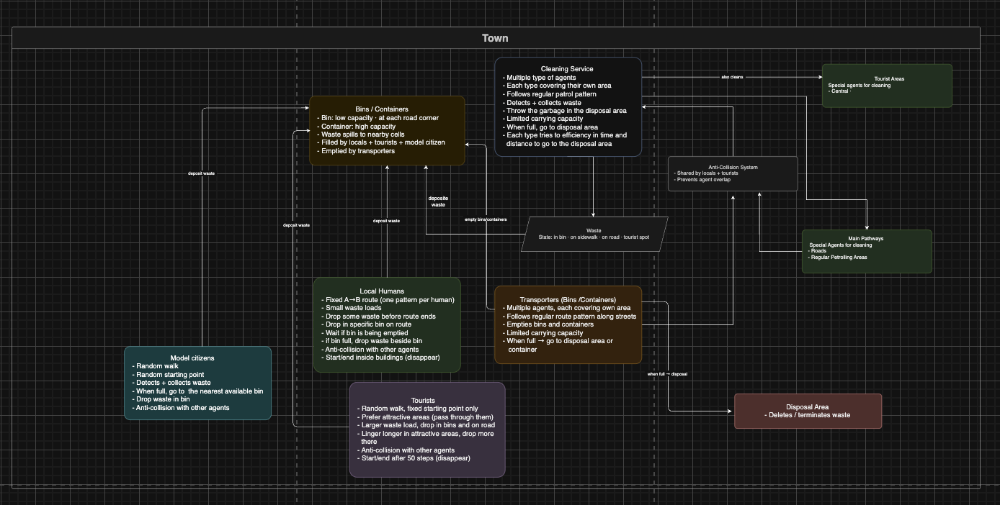
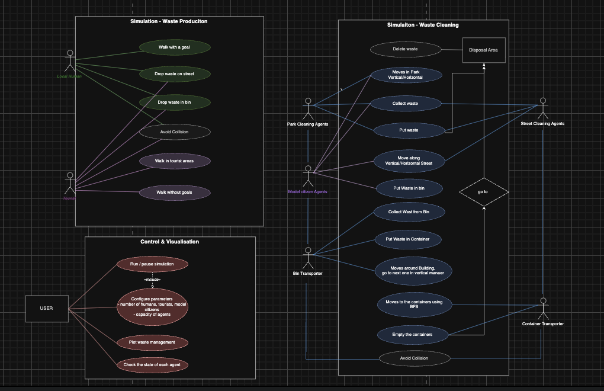
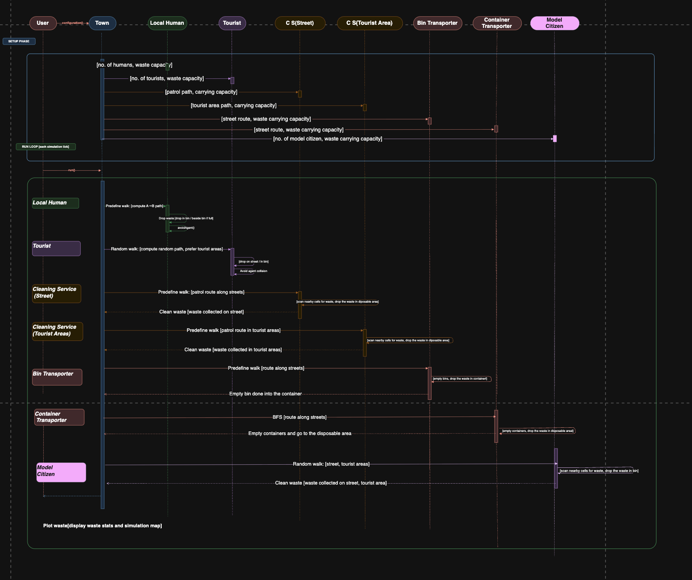

# Waste in the City — Agent-Based Model

An agent-based simulation of pedestrian movement, waste generation, and cleaning
services in a grid-based city. Built with Python and the
[Mesa](https://mesa.readthedocs.io/) ABM framework, the model studies how
city-level waste distribution emerges from the interaction of residents,
tourists, bin and container infrastructure, and a fleet of cleaning and
transport agents.

This project is part of the *Symbolic AI* course (3rd semester, MAI). The
implementation follows the component, use-case, and sequence diagrams stored in
`Diagrams/`.

---

## Overview

The simulated city consists of perpendicular roads, building blocks, a
cross-shaped park (attractive area), bins at the edges of building blocks,
larger containers at road intersections, and disposal zones on the city's east
and west borders.

The waste lifecycle is as follows:

1. Humans and tourists generate waste as they move.
2. Waste is preferably deposited into nearby bins, or otherwise dropped on the
   ground.
3. Bin transporters periodically empty bins into containers.
4. Container transporters periodically empty containers at the disposal area.
5. Street and park cleaners pick up waste left on roads and in the park, and
   also unload at the disposal area.

The focus is on emergent, system-level behavior rather than on the performance
of any single agent.

---

## Agents

| Agent | Color on map | Role |
| --- | --- | --- |
| `HumanAgent` | white | Local resident moving door to door; drops waste into bins when nearby, otherwise on the road. |
| `TouristAgent` | navy | Visitor with a park-biased random walk and a higher waste-generation rate. |
| `ModelCitizenAgent` | red | Prosocial citizen that picks up roadside waste and carries it to the nearest available bin. |
| `CleanerStreetAgent` | purple | Patrols a fixed street route, collects waste, and offloads at the disposal area when full. |
| `CleanerParkAgent` | purple | Same logic as the street cleaner, restricted to the park sector. |
| `BinTransporterAgent` | blue | Empties bins along a building-column route and transfers their content to containers. |
| `ContainerTransporterAgent` | deep pink | Empties containers and routes the waste to the disposal area. |

Cell colors used for the city map:

| Cell type | Color |
| --- | --- |
| Road | light grey |
| Building | saddle brown |
| Attractive (park) | gold |
| Door | black |
| Bin | lime green |
| Container | orange |
| Disposal | red |
| Waste | crimson |

All agents share a common `perceive → decide → act` cognitive loop defined in
`BaseAgent`.

---

## Architecture

```
model/
├── CityModel.py          # Mesa model, simulation loop, Solara visualization
├── CityGridBuilder.py    # Generates the semantic city map
├── constants.py          # Cell-type vocabulary, grid dimensions, capacities
├── agents/               # All agent classes and the AgentFactory
├── planning/             # SectorPlanner and PatrolPlanner (patrol-route generation)
└── waste/                # Bin, Container, and WasteManager
```

Key design points:

- The Mesa `MultiGrid` is the single source of truth. Cell types are stored in
  a numeric `PropertyLayer` and rendered via a categorical colormap.
- `WasteManager` is a singleton that owns the waste grid, bins, and containers,
  and notifies observers on events such as `bin_full`, `container_full`,
  `waste_appeared`, and `area_clean`.
- `SectorPlanner` discovers spatial groupings (streets, park sectors, building
  columns) from the live grid. `PatrolPlanner` turns those groupings into
  ordered patrol routes consumed by cleaners and transporters at spawn time.

### Diagrams

The implementation follows the canonical diagrams in `Diagrams/`.

**Component diagram**



**Use case diagram**



**Sequence diagram**



---

## Requirements

- Python 3.11
- Mesa 3.x
- Solara
- NumPy
- Matplotlib

---

## Installation

```bash
python -m venv venv
source venv/bin/activate          # macOS / Linux
# venv\Scripts\activate           # Windows

pip install -r requirements.txt
```

---

## Running the simulation

Launch the Solara dashboard from the project root:

```bash
solara run model/CityModel.py
```

A browser tab opens with the live city map and the waste-statistics plot.

---

## Configuration

Static parameters: 
- BINS_PER_BLOCK
- BIN_CAPACITY
- CONTAINER_CAPACITY
- CLEAN_AGENT_CAPACITY
- CONTAINER_AGENT_CAPACITY

are defined in `model/constants.py`.

Simulation scenarios are controlled through the constants exposed in
`model/constants.py`: the number of humans, tourists, and model citizens, the
number of bins and containers and agent carrying capacities .
Edit these values to experiment with different situations — for
example, a tourist-heavy city, an under-bin-supplied district, or a fleet of
high-capacity transporters — and re-run the simulation to observe how the
emergent waste distribution changes.

---

## Troubleshooting

If the default Solara port is already in use, free it and restart on a
different port.

**Windows**

```bash
netstat -ano | findstr :8766
taskkill /PID <PID> /F
solara run model/CityModel.py --port 8767
```

**macOS / Linux**

```bash
lsof -i :8766
kill -9 <PID>
solara run model/CityModel.py --port 8767
```